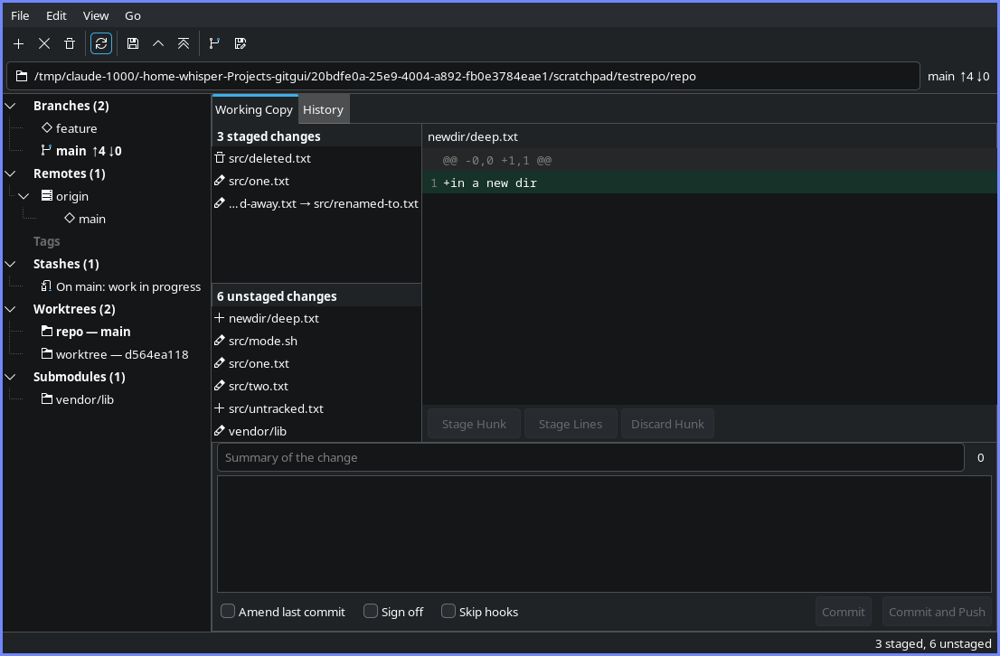
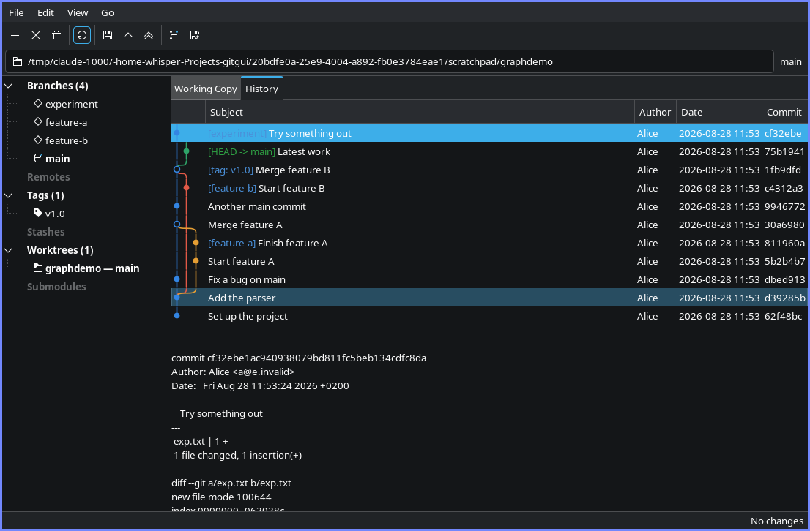
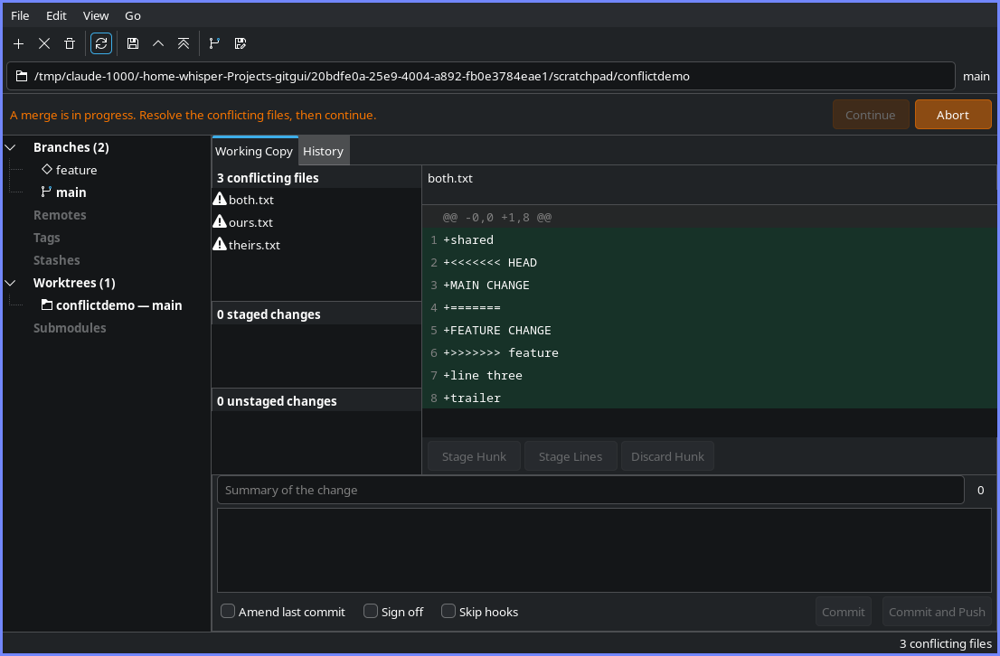

# Norn

A graphical Git client that behaves like a file manager rather than like a
specialised tool: a side pane listing everything in the repository, a main area
showing either the working copy or the history, and a location bar saying where you
are and which branch you are on.

Built on **GTK 3** through gtkmm — the same toolkit Thunar uses — so it sits
alongside the rest of an Xfce desktop rather than dragging in a second widget stack.

It wraps the `git` command line rather than linking a library, so it inherits your
`~/.gitconfig`, your hooks and your credential helpers.



## What it does

**Staging and committing**

- Stage and unstage whole files, individual hunks, or single lines
- Discard changes, with untracked files handled separately since there is nothing
  to restore them from
- Commit, amend, sign off, and skip hooks when you mean to
- Push, and force push with a lease — see below

**Branches and history**



- Branches, remotes, tags, stashes, worktrees and submodules in one side pane,
  with the checked-out branch and its ahead/behind counts always visible
- A commit graph with branch and tag labels, loaded a page at a time so a long
  history opens immediately
- Cherry-pick, revert, and interactive rebase with a reorderable plan
- Linked worktrees and submodules, each opening in a window of its own

**When things go wrong**



- A banner that says what operation is in progress and how to leave it, whether you
  started it here or in a terminal
- Conflict resolution offering the choices that actually apply to each kind of
  conflict, rather than a text merge for a file one side deleted

## Force pushing

Rewriting published history is the one operation here that can destroy someone
else's work, so it is the one with the most care taken over it.

Norn fetches first, so the lease it takes reflects what the remote actually holds
rather than a possibly stale remote-tracking ref. It then uses the explicit
`--force-with-lease=<ref>:<oid>` form together with `--force-if-includes`, and shows
you the commits that would be added **and the commits that would be destroyed**
before anything is sent. It never runs a bare `git push --force`.

## Installing

```sh
./install.sh
```

Builds and installs to `/usr`. Options:

```
--prefix <dir>   Where to install (default /usr)
--debug          Build with debug symbols and assertions
--tests          Run the test suite before installing
--no-hook        Skip the pacman rebuild-reminder hook
-h, --help       This text
```

`./uninstall.sh` removes everything it added. Your repositories and your Git
configuration are never touched — Norn does not write to either.

Arch Linux is the assumed target. Elsewhere, build it directly:

```sh
cmake -B build -G Ninja -DCMAKE_BUILD_TYPE=Release
cmake --build build
sudo cmake --install build
```

Needs gtkmm 3, gtksourceview 4, and `git` at runtime.

## Running

```sh
norn                      # the current directory
norn ~/Projects/some-repo # anywhere inside a repository
```

Any directory inside a working tree works; Norn asks git for the root rather than
guessing, so linked worktrees and submodules resolve correctly.

## Tests

```sh
cmake -B build -G Ninja -DBUILD_TESTING=ON
cmake --build build
ctest --test-dir build --output-on-failure
```

The suite covers the parts where a bug is silent rather than loud: status parsing,
patch generation for partial staging, graph layout, log parsing, and the process
plumbing itself. Generated patches are applied with real `git apply` and checked
against the resulting index, rather than compared to fixture text.
